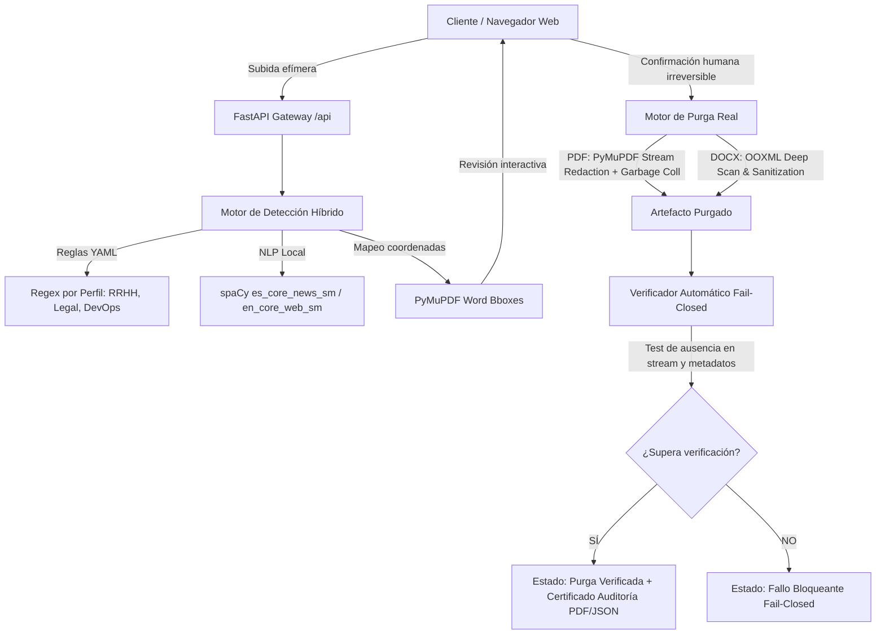

# ANCLORA PURGEDOC — ARQUITECTURA TÉCNICA

## 1. Visión General
**Anclora Purgedoc** es una plataforma de ingeniería documental para la purga y redacción física real, privada y verificada de datos sensibles en archivos PDF y DOCX.

## 2. Límites y Fronteras de Privacidad
1. **Zero External AI**: Ningún dato, fragmento o metadato se transmite a LLMs remotos ni nubes externas.
2. **Ciclo de vida efímero**: Los archivos se almacenan en `/tmp/anclora-purgedoc/{session_id}` con TTL configurable y borrado explícito.
3. **Auditoría Forense Criptográfica**: Las auditorías nunca registran el texto sensible en claro, sino su hash SHA-256 (`sha256:...`).
