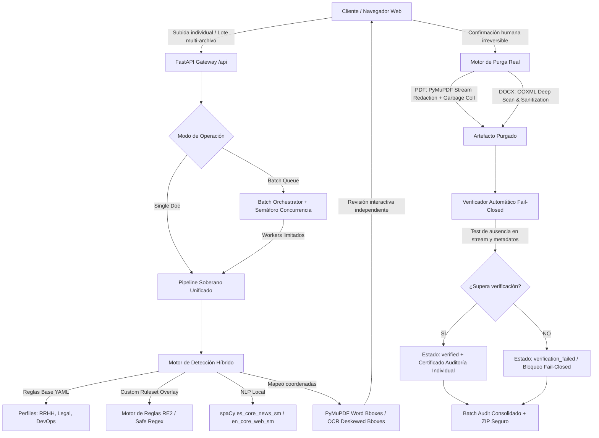

# ANCLORA PURGEDOC — ARQUITECTURA TÉCNICA

## 1. Visión General
**Anclora Purgedoc** es una plataforma de ingeniería documental para la purga y redacción física real, privada y verificada de datos sensibles en archivos PDF y DOCX, tanto en procesamiento individual como en cola de procesamiento por lotes (*Batch Document Queue*).

---

## 2. Límites y Fronteras de Privacidad
1. **Zero External AI / Cloud**: Ningún dato, fragmento, imagen o metadato se transmite a LLMs remotos ni APIs externas. 100% de la computación es local (spaCy, Tesseract, OpenCV, PyMuPDF, python-docx).
2. **Ciclo de vida efímero**: Los archivos se procesan en `/tmp/anclora-purgedoc/{session_id}/{batch_id}/{document_id}/` con TTL configurable y borrado explícito. No existe base de datos permanente de documentos ni de contenido sensible.
3. **Auditoría Forense Criptográfica**: Las auditorías individuales y de lote nunca registran el texto sensible en texto plano, sino su hash SHA-256 (`sha256:...`).

---

## 3. Arquitectura del Lote (Batch Document Queue & Batch Audit)

### 3.1 Orquestación y Reutilización del Pipeline
- **Principio Fundamental**: No existe un segundo pipeline de purga. La orquestación por lotes invoca directamente las funciones `analyze_document_content`, `purge_pdf`, `purge_docx`, `verify_pdf` y `verify_docx` del motor individual.
- **Estados Independientes por Documento**:
  `queued` → `validating` → `analyzing` → `awaiting_review` → `ready_to_purge` → `purging` → `verifying` → `verified` | `verification_failed` | `error` | `cancelled`.
- **Estados Compuestos del Lote**:
  - `draft`: Lote recién creado con documentos en cola aún no analizados.
  - `processing`: Documentos actualmente en análisis, purga o verificación con workers activos.
  - `awaiting_review`: Análisis completado; documentos esperando revisión humana interactiva.
  - `completed_verified`: Solo alcanzable si **TODOS** los documentos procesables del lote terminaron en `verified` sin ningún error ni fallo de verificación.
  - `completed_with_errors`: Asignado si al menos un documento falló (`verification_failed`, `error` o `cancelled`), garantizando que un fallo parcial nunca se disfrace de éxito global.
  - `cancelled`: Lote cancelado explícitamente.

### 3.2 Concurrencia Controlada
- Semáforo `asyncio.Semaphore` por lote gobernado por la variable de entorno `BATCH_MAX_CONCURRENT_DOCUMENTS` (valor conservador por defecto: 2).
- Evita el agotamiento de CPU y memoria RAM ante la concurrencia de Tesseract OCR, Deskew OpenCV, spaCy NLP y LibreOffice.

### 3.3 Aislamiento de Almacenamiento y Seguridad de Archivos
- **Directorio de Trabajo**: `/tmp/anclora-purgedoc/{sessionId}/{batchId}/{documentId}/`.
- **Protección contra Zip-Slip / Path Traversal**: Las rutas internas del archivo ZIP se sanean estrictamente con `os.path.basename` y se verifican para impedir saltos de directorio (`..` o `/`).
- **Garantía Soberana en ZIP**: La carpeta `documents/` del archivo `anclora-purgedoc-batch-{batchId}.zip` contiene **ÚNICAMENTE** los artefactos de salida con estado `verified`. Los documentos con fallo o corruptos se omiten de la carpeta de documentos, pero quedan debidamente registrados en el informe forense `batch-audit.json` y `batch-audit.pdf`. Los documentos originales nunca se empaquetan en el ZIP.

---

## 4. Limitaciones Conocidas y Deuda Técnica
1. **Modularidad del Backend**: `server.py` agrupa endpoints individuales y de lote. Se recomienda modularizar en routers (`backend/routes/batch.py`, `backend/routes/documents.py`, `backend/routes/rules.py`).
2. **Modularidad del Frontend**: `App.js` gestiona tanto el flujo individual como el selector de lote. Se recomienda extraer el contexto del lote en un hook dedicado si se amplían las funcionalidades.
