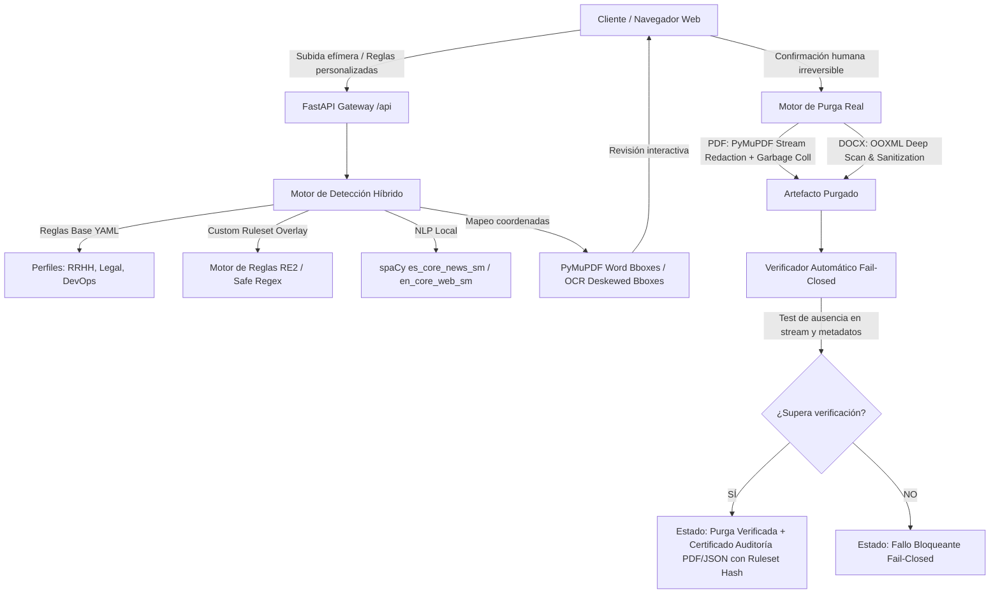

# ANCLORA PURGEDOC — ARQUITECTURA TÉCNICA

## 1. Visión General
**Anclora Purgedoc** es una plataforma de ingeniería documental para la purga y redacción física real, privada y verificada de datos sensibles en archivos PDF y DOCX.

---

## 2. Límites y Fronteras de Privacidad
1. **Zero External AI / Cloud**: Ningún dato, fragmento, imagen o metadato se transmite a LLMs remotos ni APIs externas. 100% de la computación es local (spaCy, Tesseract, OpenCV, PyMuPDF, python-docx).
2. **Ciclo de vida efímero**: Los archivos se procesan en `/tmp/anclora-purgedoc/{session_id}` con TTL configurable y borrado explícito. No existe base de datos permanente de documentos ni de contenido sensible.
3. **Auditoría Forense Criptográfica**: Las auditorías nunca registran el texto sensible en texto plano, sino su hash SHA-256 (`sha256:...`).

---

## 3. Custom Ruleset Editor & Regex Test Bench

### 3.1 Arquitectura del Motor de Reglas
- **Servicio Backend (`services/rules.py`)**:
  - Modelo `CustomRule`: `id`, `name`, `entity_type`, `pattern`, `case_sensitive`, `confidence`, `priority`, `profiles`, `enabled`, `example`.
  - Modelo `CustomRuleset`: encapsula una colección de reglas y calcula una firma criptográfica determinista (`calculate_hash()`).
  - Endpoints REST `/api/rules`:
    - `POST /api/rules/validate`: Valida la sintaxis regex y bloquea patrones peligrosos.
    - `POST /api/rules/test`: Sandbox interactivo para ejecutar el patrón sobre texto sintético de prueba sin tocar archivos reales.
    - `POST /api/rules/hash`: Cálculo orden-invariante del hash SHA-256 del conjunto de reglas.
- **Seguridad contra ReDoS (`google-re2`)**:
  - Emplea `google-re2` como motor de ejecución principal para garantizar tiempo de ejecución lineal $O(n)$ respecto al texto de entrada.
  - Bloqueo de retroceso catastrófico (catastrophic backtracking) mediante limitación estricta de longitud de patrón (≤ 1024 caracteres) y rechazo de cuantificadores anidados descontrolados.
- **Integración con la Detección**:
  - Al solicitar `POST /api/documents/{doc_id}/analyze`, el cliente envía la lista de `custom_rules`.
  - El motor de detección evalúa primero las reglas activas aplicables al perfil seleccionado.
  - Las reglas personalizadas tienen prioridad configurable (por defecto 50-70) frente a las predicciones NER estadísticas, permitiendo resolver solapamientos a favor de la regla del usuario.
- **Versionado y Hash Criptográfico**:
  - Cada ruleset genera un SHA-256 determinista basado en sus reglas activas normalizadas (orden-invariante).
  - El hash y versión se insertan en `audit.json` (`ruleset.custom_ruleset_hash`, `ruleset.custom_ruleset_id`, `ruleset.custom_ruleset_version`, `ruleset.active_custom_rules_count`), permitiendo trazabilidad forense sin divulgar los patrones sensibles.
- **Modelo de Persistencia**:
  - Persistencia del lado del cliente (`localStorage: anclora_custom_rules`) para garantizar aislamiento entre usuarios y evitar almacenamiento permanente en el servidor.
  - Exportación e importación de archivos `.json` para transferencia entre puestos de trabajo aislados (air-gapped).

---

## 4. Limitaciones Actuales y Deuda Técnica
1. **Modularidad del Backend**: `server.py` agrupa todos los endpoints. A medida que se agreguen flujos de lotes (*batch queue*), se recomienda separar en routers (`routes/documents.py`, `routes/rules.py`, `routes/sessions.py`).
2. **Modularidad del Frontend**: `App.js` gestiona el estado global de la aplicación. Con la incorporación de colas por lotes, se deberá abstraer el estado de la cola en un hook o contexto especializado.
